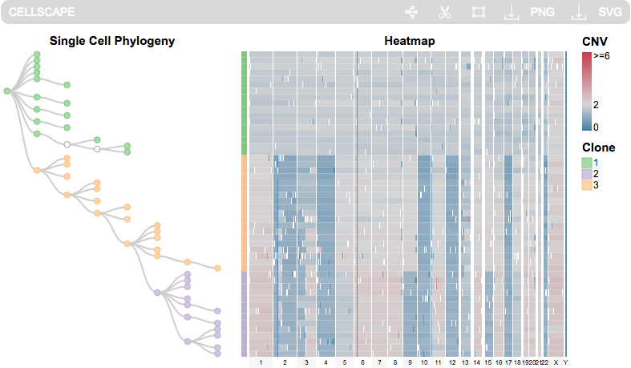

CellScape is a visualization tool for integrating single cell phylogeny with genomic content to clearly display evolutionary progression and tumour heterogeneity. 

To run CellScape, type the following commands in R:

install.packages("devtools") # if not already installed  
library(devtools)  
install_bitbucket("MO_BCCRC/cellscape")  
library(cellscape)  
example(cellscape) # to run examples

And two visualizations will appear in your browser (optimized for Chrome).

The first shows single cell targeted mutation data from xenograft SA501 published in Eirew et al. (2015). This dataset has a time-series component.

The second shows copy number data of a triple negative breast cancer patient published in Wang et al. (2014).

CellScape was developed at the Shah Lab for Computational Cancer Biology at the BC Cancer Research Centre.

References:  

Eirew, Peter, et al. "Dynamics of genomic clones in breast cancer patient xenografts at single-cell resolution." Nature 518.7539 (2015): 422-426.

Wang, Yong, et al. "Clonal evolution in breast cancer revealed by single nucleus genome sequencing." Nature 512.7513 (2014): 155-160.
